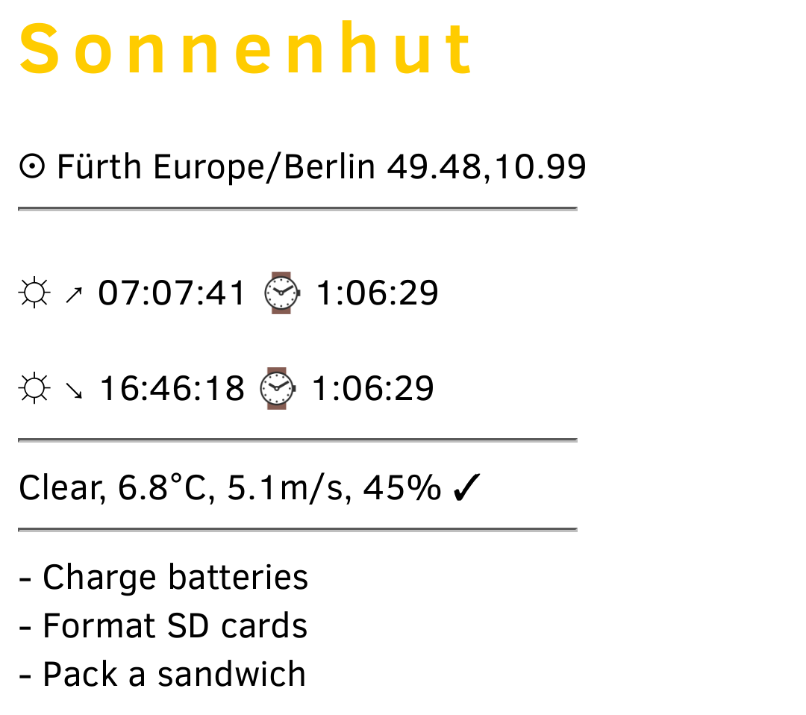

Sonnenhut 1.2.0
===============

.. image:: https://travis-ci.org/dmpop/sonnenhut.svg?branch=develop
    :target: https://travis-ci.org/dmpop/sonnenhut

A simple Python-based web app for photographers that displays basic information such
as current weather conditions and golden hour for a specified location.

The app provides the following information:

-  Golden hour start and duration
-  Brief weather summary
-  Current temperature, wind speed, and humidity
-  Precipitation warning

The app also shows notes from the accompanying *sonnenhut.txt* file
(created automatically during the fist run).

Quick Start
===========

#. Install the required packages. On openSUSE, run the ``sudo zypper in python3 python3-virtualenv python3-pip`` command.

#. Create a Python 3 virtual environment nd activate it::

    $ pyvenv .env
    $ source .env/bin/activate

#. Install Sonnenhut::

     pip install git+https://github.com/dmpop/sonnenhut.git@develop

#. Run the ``sonnenhut`` command and point your browser to `<http://127.0.0.1:8080/sonnenhut/<city>>`_ (replace *<city>* with the actual name of the desired city).

Installation
============

#. Clone the project's repository::

    $ git clone https://github.com/dmpop/sonnenhut
    $ cd sonnenhut

#. Create a Python 3 environment and activate it::

    $ pyvenv .env
    $ source .env/bin/activate

#. Optionally update the ``pip`` and ``setuptools`` modules::

    $ pip install -U pip setuptools

#. Install the package::

    $ ./setup.py develop

Usage
-----

Run the ``sonnenhut`` command and point your browser to
http://127.0.0.1:8080/sonnenhut/<city> (replace *<city>* with the actual name of the
desired city).

Credits
-------

Thanks to Thomas Schraitle for help and guidance.

License
-------

`The GNU General Public License version
3 <https://www.gnu.org/licenses/gpl-3.0.txt>`__
